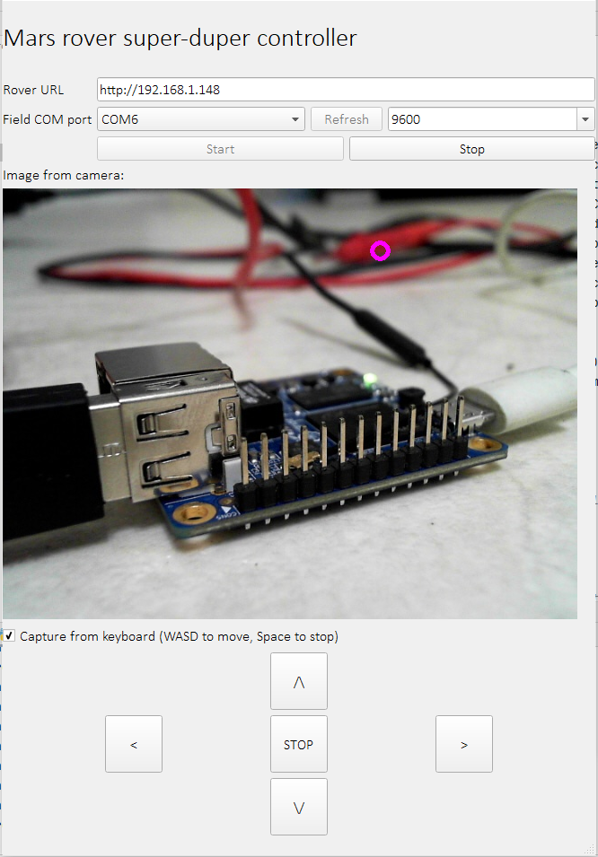

# Host-Rover-test
## Test software for communication between (Orange Pi based rover) and host (computer)



This software was developed as part of project activity in goup 181-311 at the Moscow Polytechnic univercity

This repository and the code in it were created for informational purposes only and are distributed under the Unlicense license (https://unlicense.org)

Tested on Orange Pi Zero with Armbian_21.05.6_Orangepizero_buster_current_5.10.43

```
sudo apt-get install git
sudo apt-get install python3-dev
sudo apt-get install python3-pip
sudo apt-get install python3-opencv
pip3 install setuptools
pip3 install wheel
pip3 install flask
pip3 install OrangePi.GPIO
git clone https://github.com/XxOinvizioNxX/Host-Rover-test
cd Host-Rover-test/rover
python3 rover.py
```
